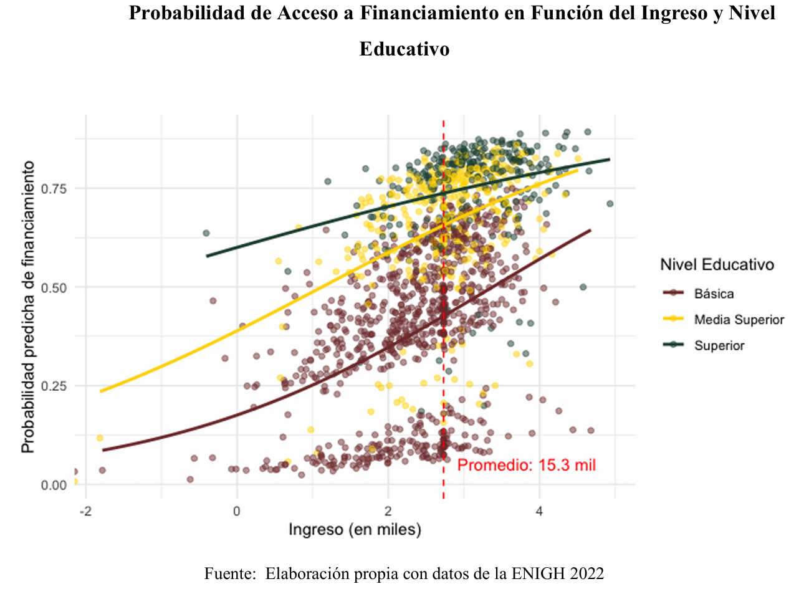
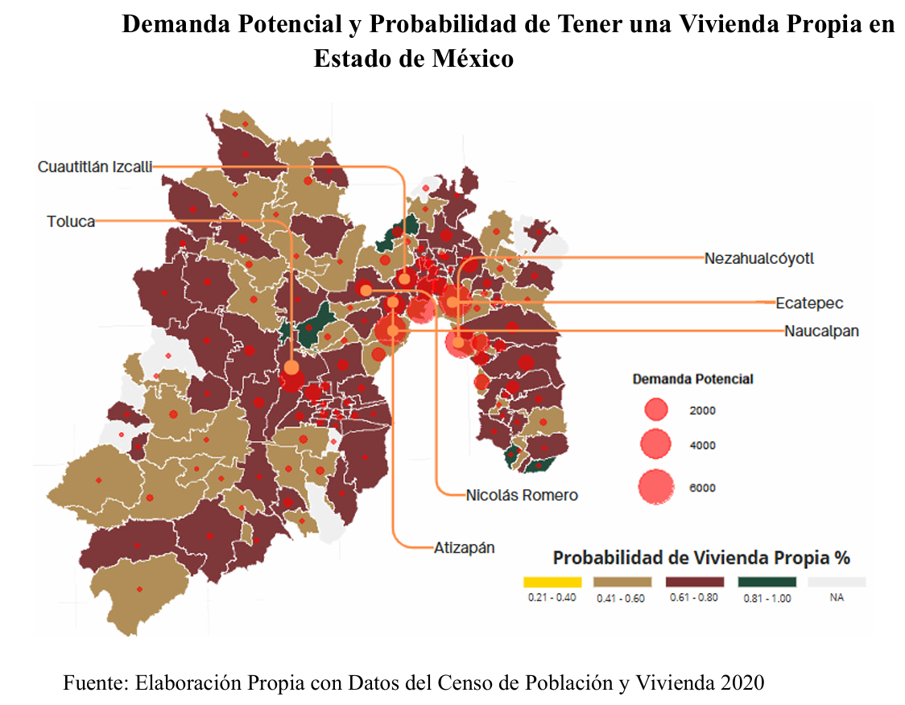

# Data-Science-Portfolio

Javier Alamilla Montaño - Economista & Científico de Datos
*Especialización en Ciencia de Datos Aplicada*

---

## Proyectos Destacados

### Cerrando la Brecha Habitacnional: Inteligencia de Datos para Mujeres Jefas de Hogar y Acceso al Financiamiento. (Infonavit)

*   **Descripción:** En este proyecto realicé un análisis de caracterización y modelado de la demanda de vivienda en México, con un enfoque prioritario en mujeres jefas de hogar. Utilicé datos de La Encuesta Nacional de Ingresos y Gastos de los Hogares (ENIGH) 2022 y del Censo de Población y Vivienda 2020 para desarrollar modelos de propensión al crédito y adquisición de vivienda, integrando técnicas de machine learning para el rigor estadístico.

*   **Problema de Negocio:** Tradicionalmente, **Infonavit** ha operado como una institución de financiamiento. Sin embargo, ante el cambio de modelo estratégico donde el Instituto comenzará a gestionar la construcción y oferta directa de vivienda, el riesgo operativo aumenta significativamente. El reto principal es evitar la construcción de desarrollos habitacionales en zonas sin demanda real. Por ello, se requería un análisis de inteligencia de mercado que permitiera perfilar y localizar la demanda potencial. Decidimos enfocar este análisis en las mujeres jefas de hogar, un segmento crítico y subatendido, para garantizar que la nueva oferta de vivienda responda a las necesidades de este sector y asegure la viabilidad financiera de los nuevos proyectos de construcción.

*   **Objetivos:** Desarrollar dos modelos de **Regresión Logística con penalización Lasso** para: 1) Identificar a las mujeres con mayor probabilidad de acceder a un financiamiento de vivienda según su perfil demográfico y económico. 2) Estimar la probabilidad efctiva de adquisición de vivienda. Finalmente, georreferenciar estos hallazgos en un mapa de calor a nivel municipal para localizar nodos de demanda potencial.

*   **Resultados:** 
    * **Modelo 1: Probabilidad de acceso a Financiamiento de Vivienda.**
      

        
         
        <em>Figura :Probabilidad de Acceso a Financiamiento en Función de Ingreso y Nivel Educativo.</em>
      

        
       El modelo identificó que el rango de ingresos entre $15.3k y $60.3k MXN es el más crítico, donde la probabilidad de acceso al crédito se dispara en un 20%. El hallazgo más relevante fue la detección de 163,492 mujeres **"Falsos Positivos"**: perfiles que cumplen con todos los requisitos de elegibilidad (ingreso, educación, estabilidad), pero que el mercado actual no está atendiendo.

    * **Modelo 2: Probabilidad de Adquirir una Vivienda Propia.**
 
       Al integrar datos del Censo de Población y Vivienda 2020, el modelo cuantificó que contar con financiamiento formal hace que una mujer jefa de hogar tenga **22 veces más probabilidades** de ser propietaria. Se identificó un nicho de 398,923 mujeres con perfil preferente que aún no poseen vivienda propia, representando el mercado objetivo primario para los nuevos desarrollos de Infonavit
 
      
*   **Impacto Geográfico y Política Pública (Caso EdoMex)**

  

  
   
  <em>Figura : Mapa de demanda potencial y probabilidad de vivienda propia en el Estado de México.</em>

      El análisis permitió mapear la demanda potencial a nivel municipal. En el Estado de México, el modelo funcionó como herramienta de decisión al localizar municipios con probabilidad media-alta de adquisición donde existe una alta densidad de jefas de hogar sin vivienda. Esto permite que Infonavit no solo otorgue el crédito, sino que planifique la construcción física en las zonas con mayor retorno social y financiero.

> [!TIP]
> **Key Insight:** El ingreso resultó ser el factor determinante en la demanda potencial, permitiendo segmentar el mercado nacional con una precisión municipal.
